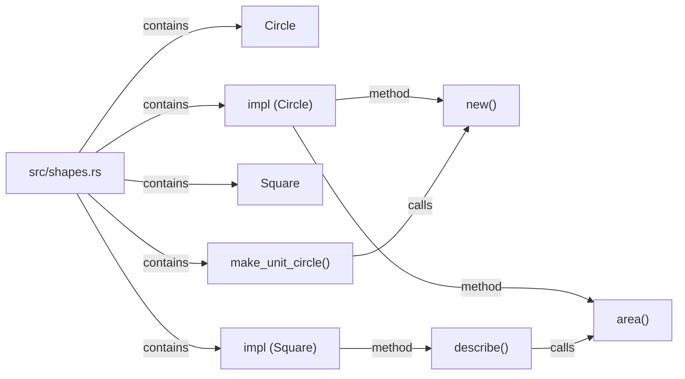
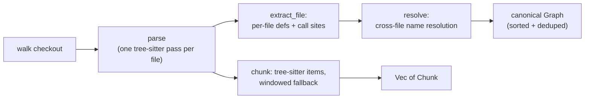

# lci-codegraph

[](https://github.com/vymalo/codegraph/actions/workflows/ci.yml)
[](https://crates.io/crates/lci-codegraph)
[](https://docs.rs/lci-codegraph)
[](LICENSE)

`lci-codegraph` walks a source checkout and, from **one** tree-sitter parse per file, produces both
semantic chunks (ready to embed for search) and a structural call graph with cross-file resolution.
It is a pure extractor — no database, no network client, no cluster dependency — the caller decides
where the output goes.

## Install

```toml
[dependencies]
lci-codegraph = "0.1"
```

MSRV: Rust **1.85** (the crate is edition 2024).

## Quickstart

```rust
use std::path::Path;

use lci_codegraph::{WalkOptions, walk_checkout};

fn main() -> anyhow::Result<()> {
    let root = Path::new(".");
    let options = WalkOptions::builder().build_graph(true).build();

    let output = walk_checkout(root, &options)?;

    // Chunks: ready to hand to an embedding model.
    for chunk in &output.chunks {
        println!(
            "{} [{}] {:?} L{}-{}",
            chunk.file_path, chunk.chunk_type, chunk.symbol_name, chunk.start_line, chunk.end_line
        );
    }

    // Graph: definitions and the calls between them, resolved across files.
    for edge in &output.graph.edges {
        println!("{} --{}--> {}", edge.source, edge.relation, edge.target);
    }

    Ok(())
}
```

Both come out of the **same walk** — the tree is parsed once per file and fed to the chunker and the
graph builder together (`build_graph: false`, the default, skips graph extraction and returns an
empty `Graph`, so a caller that only wants chunks pays nothing extra).

## The output model

### Chunks

A [`Chunk`](https://docs.rs/lci-codegraph/latest/lci_codegraph/struct.Chunk.html) is one embeddable
unit of source: `file_path`, `language`, `chunk_type` (`"function"`, `"class"`, `"impl"`, `"window"`,
…), an optional `symbol_name`, a 0-based `start_line`/`end_line` line range, and the `content` text.
Structured languages get tree-sitter-extracted items (functions, structs, classes, impls, methods);
everything else — or a file too large to parse, or a language with no grammar — falls back to
fixed-size overlapping line windows.

### Graph

A [`Graph`](https://docs.rs/lci-codegraph/latest/lci_codegraph/struct.Graph.html) is a flat list of
[`GraphNode`]s (`node_id`, `label`, `source_file`, `start_line`) and [`GraphEdge`]s (`source`,
`target`, `relation`). Three relations are emitted:

- **`contains`** — a file → its top-level definitions, and a container definition (`mod`/`struct`/
  `trait`/`enum`/`class`/…) → the definitions nested inside it.
- **`method`** — a type container (`impl`/`trait`/`struct`/`enum`/`class`/`interface`) → a callable it
  defines directly. This is a specialisation of `contains` kept as its own relation.
- **`calls`** — a caller definition → a callee definition, resolved **across files**: a call recorded
  in file A can resolve to a definition in file B.

Two conventions to know when reading node ids and labels:

- **Line numbers in the graph are 1-based** (`start_line: 1` is the file's first line) — unlike a
  `Chunk`'s 0-based `start_line`/`end_line`.
- **Callable labels carry a `()` suffix**: a function named `add` gets the label `add()`; a
  non-callable definition (a struct, a class, an `impl` block) keeps its bare name.

Here is a real excerpt of the committed golden (`tests/golden/sample-repo.graph.json`) — a Rust
fixture with a `main.rs` that calls into `math.rs`:

```json
{
  "nodes": [
    { "node_id": "src/main.rs", "label": "main.rs", "source_file": "src/main.rs", "start_line": 1 },
    { "node_id": "src/main.rs#3:main", "label": "main()", "source_file": "src/main.rs", "start_line": 3 },
    { "node_id": "src/math.rs#2:add", "label": "add()", "source_file": "src/math.rs", "start_line": 2 },
    { "node_id": "src/math.rs#7:print_result", "label": "print_result()", "source_file": "src/math.rs", "start_line": 7 }
  ],
  "edges": [
    { "source": "src/main.rs", "target": "src/main.rs#3:main", "relation": "contains" },
    { "source": "src/main.rs#3:main", "target": "src/math.rs#2:add", "relation": "calls" },
    { "source": "src/main.rs#3:main", "target": "src/math.rs#7:print_result", "relation": "calls" }
  ]
}
```

`main()` in `src/main.rs` calling `add()` and `print_result()` in `src/math.rs` are the two
**cross-file** `calls` edges — the part a per-file extractor cannot produce on its own.

The same fixture's `shapes.rs`, drawn as a graph:



### Pipeline



## Language support

| Language | Extensions | Chunking | Graph extractor |
|---|---|---|---|
| Rust | `.rs` | tree-sitter | Native node-kind extractor (`interesting_node` + `call_expression` navigation) — kept separate so the committed golden stays byte-stable |
| Python | `.py` | tree-sitter | The grammar's bundled `tags.scm` (`tree-sitter-python::TAGS_QUERY`) |
| JavaScript | `.js`, `.jsx`, `.mjs`, `.cjs` | tree-sitter | The grammar's bundled `tags.scm` (`tree-sitter-javascript::TAGS_QUERY`) |
| TypeScript | `.ts` | tree-sitter | JavaScript's `tags.scm` **composed with** TypeScript's `tags.scm` — the TS query alone only covers TS-specific constructs (signatures, interfaces, modules), not concrete `class`/`function`/`method`/`call` |
| TSX | `.tsx` | tree-sitter (JSX-aware grammar) | Same composed JS+TS `tags.scm`, run against the dedicated TSX grammar (the plain TypeScript grammar cannot parse JSX) |
| Java | `.java` | tree-sitter | The grammar's bundled `tags.scm` (`tree-sitter-java::TAGS_QUERY`) |

For every one of these, chunking and graph extraction share the **same** parse of the file
(`WalkOptions::build_graph`).

A few more extensions are recognised as a language *label* with no tree-sitter grammar in this crate
— `.go`, `.c`/`.h`, `.cpp`/`.cc`/`.cxx`/`.hpp`, and a generic `text` bucket for `.md`/`.txt`/`.toml`/
`.yaml`/`.yml`/`.json`. These are chunked via the windowed-line fallback only (no structured chunks,
no graph). Any file whose extension is not recognised at all is skipped entirely — not chunked, not
graphed.

Adding a language means implementing one `LanguageSupport` in `src/lang/<language>.rs` and adding it
to the registry; see `docs/architecture.md`.

## Configuration

`WalkOptions` ([`bon`](https://docs.rs/bon) builder):

| Field | Default | Meaning |
|---|---|---|
| `tuning` | `IndexTuning::default()` | Chunking/window sizing (below) |
| `respect_gitignore` | `true` | Honour the repo's own `.gitignore` (and nested/parent ignore files) |
| `build_graph` | `false` | Build the structural graph. Off by default: a caller that only wants chunks pays no graph-extraction cost |
| `extract_pdfs` | `true` | Extract text from PDFs and chunk it |
| `extra_ignore_globs` | `[]` | Operator-supplied gitignore-syntax globs, layered on top of the built-in defaults |

`IndexTuning` fields, each readable from an environment variable via
[`IndexTuning::from_env`](https://docs.rs/lci-codegraph/latest/lci_codegraph/struct.IndexTuning.html)
(unset or unparseable falls back to the default; every value is clamped to `>= 1`):

| Field | Env var | Default | Meaning |
|---|---|---|---|
| `embed_batch_size` | `INDEX_EMBED_BATCH_SIZE` | `32` | Chunks per embedding round-trip |
| `max_chunk_lines` | `INDEX_MAX_CHUNK_LINES` | `150` | Max lines a structured chunk may span before falling back to windowing |
| `window_size` | `INDEX_WINDOW_SIZE` | `100` | Windowed-fallback window size, in lines |
| `window_step` | `INDEX_WINDOW_STEP` | `50` | Windowed-fallback step, in lines (overlap = `window_size - window_step`) |

[`walk_checkout_from_env(root, build_graph)`](https://docs.rs/lci-codegraph/latest/lci_codegraph/fn.walk_checkout_from_env.html)
is a convenience that builds `WalkOptions` from the environment: `IndexTuning::from_env()` for
tuning, and `LCI_CODEGRAPH_IGNORE_GLOBS` (newline- or comma-separated) for `extra_ignore_globs`.
`build_graph` itself is a plain function argument, not read from the environment.

## The ignore model

The operator ignore layer **composes with** the repo's own `.gitignore` — it does not replace it.
`walk_checkout` drives the file walk with [`ignore::WalkBuilder`](https://docs.rs/ignore), which
honours the repo's `.gitignore` (and nested/parent ignore files) natively when `respect_gitignore` is
true; `IgnoreList` is then applied as an *additional* filter on top, so a junk directory that slipped
past the repo's own rules (or a repo with no `.gitignore` at all) still gets skipped. Every skip is
logged at `debug`/`info` so an over-broad glob is diagnosable rather than silently hiding real files.

`DEFAULT_IGNORE_GLOBS` — the built-in defaults, always included unless a caller builds `IgnoreConfig`
directly with `include_defaults(false)`:

```
target/  node_modules/  .git/  dist/  build/  vendor/  .venv/  venv/  .next/  __pycache__/
```

## PDF handling

Repos carry documentation as PDFs; those get bounded text extraction and are fed to the same
windowed-chunk path plain text files take. PDF parsing over **untrusted repo input** is a crash/OOM/
hang surface, so extraction is bounded in layers:

- Input bytes are capped at the I/O level (`MAX_PDF_BYTES`, 5 MiB) **before** the parser ever sees the
  file — a multi-gigabyte "PDF" never lands in memory whole.
- Before the real parser runs, every `FlateDecode` content stream is pre-flighted through a bounded
  inflate (`MAX_PDF_DECOMPRESSED_BYTES`, 256 MiB cumulative budget) that never materialises more than
  a small buffer, rejecting a decompression bomb before it can trigger an (uncatchable) allocation
  failure.
- The real parse runs on a worker thread under a 15s (`PDF_PARSE_TIMEOUT`) watchdog.
- The parser call is wrapped in `catch_unwind` (`pdf-extract` can panic on malformed input), and
  extracted text is truncated to `MAX_PDF_TEXT_BYTES` (2 MiB).

Honest residual limits, documented in `src/pdf.rs`: the decompression guard only covers `FlateDecode`
streams found by a syntactic scan — a bomb behind a non-Flate or cascaded filter, or a blow-up in
font/glyph tables rather than stream inflation, is not pre-flighted. The wall-clock watchdog is the
only backstop for those, and on timeout the worker thread is *abandoned*, not killed — its memory is
not reclaimed. A hard per-parse memory ceiling (subprocess + `RLIMIT_AS`) is not implemented here; a
caller running this over fully untrusted input at scale should isolate the process accordingly.

## Testing

```sh
cargo test
```

runs the unit tests (each module) and the integration suite `tests/parity.rs`, which walks a
committed fixture repo (`tests/fixtures/sample-repo`) and asserts the canonicalised graph is
byte-identical to the committed golden (`tests/golden/sample-repo.graph.json`) — the regression guard
for the graph engine. Regenerate the golden intentionally with:

```sh
UPDATE_GOLDEN=1 cargo test --test parity
```

```sh
cargo test --features container-tests
```

additionally runs the Docker-backed suites — each needs a **running Docker daemon**:

- `container_neo4j` — loads the emitted nodes/edges into a real Neo4j with the same generic
  `:Symbol` + `[:REL {relation}]` write a downstream host performs, then runs the retrieval queries
  against it, proving the downstream retrieval contract end to end.
- `container_build` — builds and runs the crate inside Linux glibc and musl containers.
- `container_repos` — clones pinned real-world repositories inside a container and asserts the walk
  holds its invariants on input nobody wrote for the tests.

## Determinism

The graph returned by `walk_checkout`/`walk_checkout_from_env` is canonicalised: nodes and edges are
sorted and deduplicated before being returned (`Graph`'s `resolve` step). Running the same walk twice
over the same checkout produces byte-identical output — stable to snapshot in a golden test, and
stable to submit downstream without spurious diffs.

## Limitations

Cross-file `calls` resolution is precision-favouring, not best-effort: when a bare callee name matches
**more than one** definition and no qualifier narrows it to exactly one, the call is **dropped**, not
guessed — it is never fanned out to every same-named candidate and never resolved to an arbitrary one.
Concretely: a name defined in two files with no importing/qualifying context to tell them apart
produces no `calls` edge for that call site. A qualifier is recovered only from the immediate receiver
in the source (`Foo.bar()` → qualifier `Foo`) — there is no type inference, so `self`/`this`/`cls`/
`super` receivers, and calls through a variable of unknown type, carry no qualifier and resolve on the
bare name alone (a single match still resolves; multiple still drop). This trades recall for not
mis-attributing a call to the wrong definition.

## Provenance

Exported from [`vymalo/lightbridge-code-intelligence`](https://github.com/vymalo/lightbridge-code-intelligence).
Design rationale: [ADR-0086](docs/adr/0086-in-house-code-graph-crate.md). Licensed under
[MIT](LICENSE).
