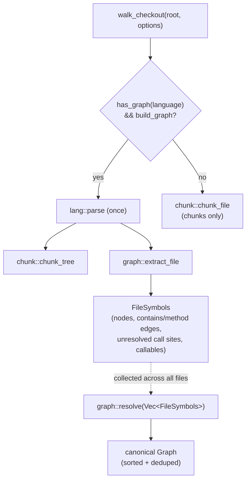

# Architecture

This is the document to read before touching `src/graph/`. It describes how the pipeline actually
fits together, based on the code as it stands — not the aspirational shape.

## The one-parse design

Everything downstream of a source file starts from a single `tree_sitter::Tree`. `src/walk.rs`
(`walk_checkout`) parses each file **once** (`lang::parse`) and hands that one tree to both:

- the chunker (`chunk::chunk_tree`), and
- the graph extractor (`graph::extract_file`), when `WalkOptions::build_graph` is set.

This only happens on the fast path — a language with a real graph extractor
(`lang::has_graph(language)`). If graph extraction is off, or the language has no extractor, the file
is chunked via `chunk::chunk_file`, which re-parses internally if it needs to; there is no second
parse when both chunking and graph extraction run, which is the case the one-parse design exists for.



`walk_checkout` collects one `FileSymbols` per graph-eligible file into a `Vec<FileSymbols>`, then
calls `graph::resolve` exactly once at the end, over the whole checkout — cross-file resolution needs
every file's definitions to exist before it can attribute a call correctly.

## The `Classifier` seam

`src/graph/emit.rs` runs one shared depth-first walk (`walk`) that emits definition nodes,
`contains`/`method` edges, and unresolved call sites. What differs per language is *how a tree-sitter
node is recognised as a definition or a call site* — that recognition is factored out behind
`emit::Classifier`:

```rust,ignore
enum Classifier<'a> {
    Rust,
    Tagged(&'a tags::TaggedSymbols),
}
```

- **`Classifier::Rust`** delegates to the same `interesting_node` function the chunker uses
  (`chunk::interesting_node`, matching on tree-sitter node kinds like `function_item`, `impl_item`,
  `struct_item`) plus a dedicated `call_expression` navigation (`graph::callee::callee_ref_of`) for
  call sites. This is Rust's own hand-written node-kind extractor. It exists so chunk and graph
  symbols stay in lock-step for Rust specifically, and so the committed golden
  (`tests/golden/sample-repo.graph.json`) is byte-stable — a property a query-driven extractor
  running someone else's grammar-authored query would not guarantee across grammar upgrades.
- **`Classifier::Tagged`** wraps a `tags::TaggedSymbols` — the result of running the language's
  bundled `tags.scm` query (`tags::extract`) once per file, *before* the DFS starts. Every other
  supported language (Python, JavaScript, TypeScript, TSX, Java) goes through this path. The tags
  query gives definitions (`@definition.function`, `@definition.class`, …) and call references
  (`@reference.call`) keyed by tree-sitter node id, which `Classifier::Tagged::classify`/`call_site`
  look up by node id during the walk.

Which classifier a language uses is decided once, per file, by `lang::LanguageSupport::graph_strategy`
(`GraphStrategy::RustNative` vs. `GraphStrategy::Tags(&'static Query)`) — see `src/lang/mod.rs`. This
is the single place that determines Rust-native vs. tags-based; the rest of `emit.rs`,
`graph::callee`, and `graph::resolve` are written against the `Classifier` abstraction and do not
know or care which source produced it.

What the tags query does **not** give — and what `emit.rs` still derives from the tree itself,
identically for both classifier variants — is containment (which definition is nested inside which)
and the call qualifier (the receiver of a qualified call, e.g. the `Foo` in `Foo.bar()`). Both are
positional facts about where a node sits in the tree, not something a flat tag list carries.
`Classifier::container_scope` and `Classifier::call_site`'s qualifier handling exist specifically to
recover those two facts uniformly, regardless of classifier source.

## Per-file extraction: recording, not resolving

`graph::extract_file` produces a `FileSymbols` for one file:

- `nodes: Vec<GraphNode>` — the file node itself (`node_id` = the file path, 1-based `start_line: 1`)
  plus one node per definition found by the walk.
- `contains: Vec<GraphEdge>` — the `contains`/`method` edges, fully resolved *within this file* (a
  definition's parent is always known at emission time — it is the top of the `stack` the DFS
  maintains).
- `calls: Vec<CallSite>` — **unresolved**. Each is `{ caller: String, name: String, qualifier:
  Option<String> }`: the enclosing definition's node id, the bare callee name, and an optional
  qualifier. Nothing here is a graph edge yet — resolving a `CallSite` to an actual target definition
  requires knowing about definitions in *other* files, which isn't available until every file has
  been walked.
- `callables: Vec<Callable>` — every function/method definition found, `{ name, node_id, scope }`,
  where `scope` is the enclosing type name (a Rust `impl S` or a `class C`) used only to disambiguate
  same-named callables later. This is the table `resolve` matches call sites against.

The DFS (`emit::walk`) threads three pieces of state as it descends: a `stack` of enclosing definition
node ids (for `contains` parenting and for attributing a call site to its caller), a `scope` (the
nearest enclosing type name, for method disambiguation), and an `enclosing_kind` (to decide whether a
callable directly inside it should be a `method` edge — `is_type_container` matches `impl`/`trait`/
`struct`/`enum`/`class`/`interface` — or a plain `contains`).

Node ids are deterministic and content-derived: `def_node_id` formats them as
`<file>#<line>:<name-or-kind>` (e.g. `src/shapes.rs#9:new`), so the same input always produces the
same id — no counters, no UUIDs.

## Cross-file resolution

`graph::resolve::resolve(files: Vec<FileSymbols>) -> Graph` is the only place that looks across files.
It builds two lookup tables keyed by bare callee name:

1. a **global** table (`HashMap<&str, Vec<&Callable>>`) covering every callable in every file, and
2. for each file in turn, a **local** table covering only that file's callables.

For each unresolved `CallSite`, resolution tries the local table first (same-file definitions win),
falling back to the global table only when the local table has no match, or when the local match is
itself ambiguous and the global table can still narrow it down. This local-first policy means a
same-named definition in another file never shadows an unambiguous local one.

### How ambiguity is handled

The core of `pick()` is a three-way outcome, not a boolean:

```rust,ignore
enum Pick<'a> {
    One(&'a str),   // exactly one candidate — emit the edge
    Ambiguous,      // several same-named candidates, qualifier didn't narrow it — drop, count
    None,           // no candidate in this table — try the next one
}
```

- **A single candidate** resolves, unless a *type* qualifier is present and positively contradicts it
  (`only.scope.as_deref() != Some(q)`) — a *module*-style qualifier that isn't a type scope still
  matches, so `math::add()` resolves to a free function `add` with no type scope.
- **Several same-named candidates** resolve only if a qualifier narrows the set to exactly one match
  on `scope`. Otherwise the call is **ambiguous** — and an ambiguous call is *dropped*, not resolved
  to an arbitrary candidate and not fanned out to every candidate. This is the deliberate,
  precision-favouring choice documented directly in `resolve.rs`: "a bare name matching several
  same-named defs is dropped and counted, not fanned out."

Concretely: if `foo()` is defined in two files and the call site has no qualifier that can tell them
apart, `resolve` produces **no** `calls` edge for that call — not one arbitrary one, and not two. This
trades recall for never mis-attributing a call to the wrong definition. `ambiguous`/`unresolved`
counts are logged (`tracing::debug!`) so this is visible, not silent.

Qualifiers themselves are recovered structurally, not through type inference:
`graph::callee::qualifier_from_callee_node` looks at the callee name node's *immediate* parent in the
tree (`member_expression`/`attribute`/`method_invocation`) and takes its `object`/receiver, but only
when that receiver is a plain identifier that isn't `self`/`cls`/`this`/`super` (those carry no type
information and are deliberately treated as "no qualifier" rather than a bogus one). There is no
attempt to resolve a receiver's actual type — a call through a variable of unknown type resolves the
same as an unqualified call.

## Canonicalisation

After every file's call sites are resolved, `resolve` sorts and dedups both `nodes` and `edges`
(`GraphNode`/`GraphEdge` derive `Ord`) before returning the `Graph`. This is what makes the output
stable enough to snapshot as a golden file and stable enough to submit downstream without spurious
diffs between runs over the same input.

## Adding a language

A language with a real graph extractor is one `LanguageSupport` implementation in
`src/lang/<language>.rs`, registered in the `REGISTRY` slice in `src/lang/mod.rs`. For a
tags-driven language that means: point `ts_language()` at the grammar, and return
`GraphStrategy::Tags(&query)` where `query` is the grammar's bundled `TAGS_QUERY` (composed with
another language's `TAGS_QUERY` first, if the grammar's own tags file doesn't cover concrete
class/function/method/call nodes on its own — see `src/lang/typescript.rs` for the composed-query
pattern). Nothing in `emit.rs`, `graph::callee`, or `graph::resolve` needs to change: they are written
against `Classifier`/`GraphStrategy`, not against a per-language `match`. A language with no
`graph_strategy` (i.e. no grammar in this crate at all) is still chunked via the windowed-text
fallback — it is simply absent from `graph::resolve`'s input.
